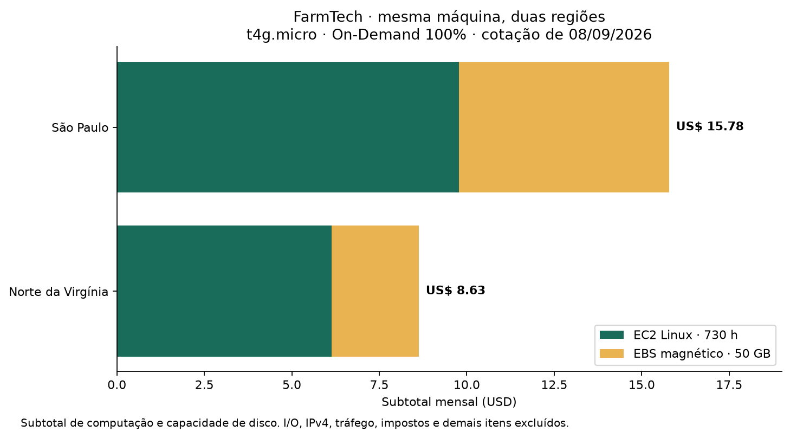
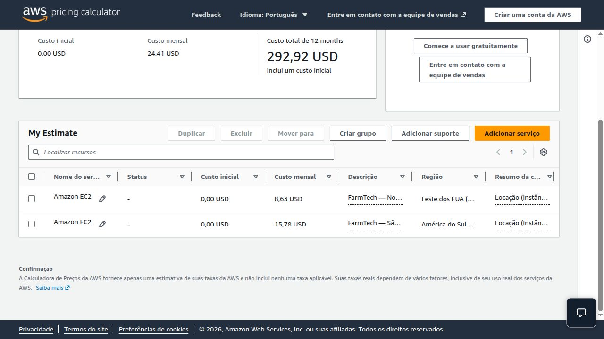
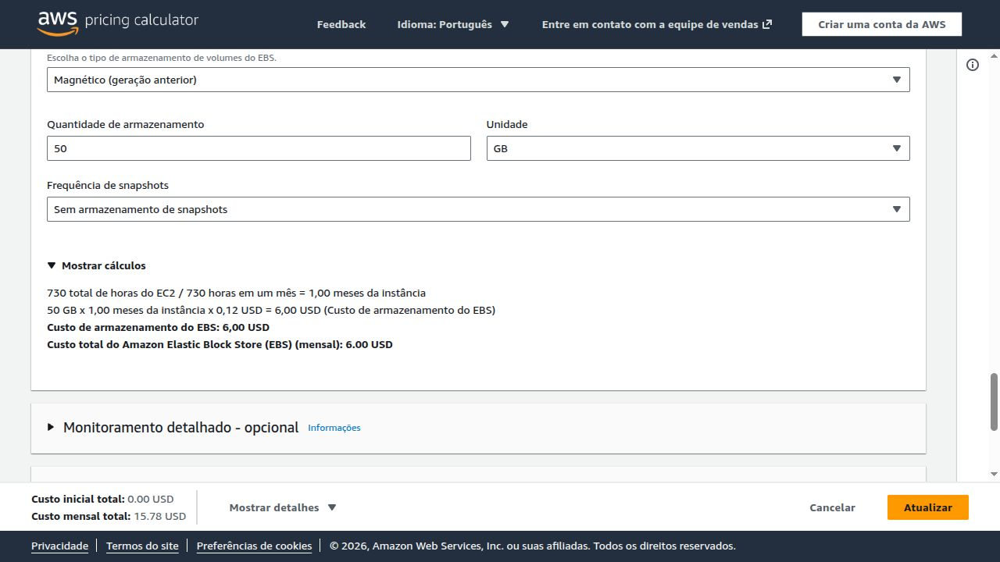
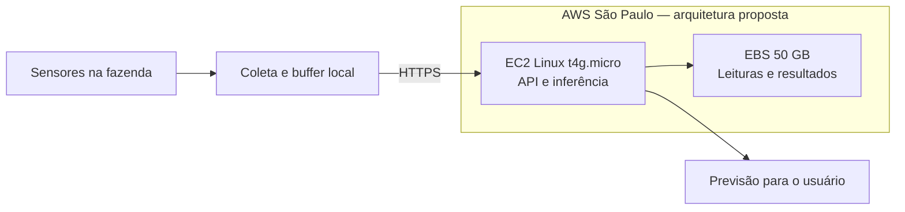

# FIAP — FarmTech Solutions

<p align="center"><a href="https://www.fiap.com.br/"></a></p>

## Fase 5 — Machine Learning na Cabeça

**Grupo:** FarmTech Solutions

**Integrante:** Gabriel Marcolino Ramos — **RM565717**

**E-mail acadêmico:** rm565717@fiap.com.br

Atividade proposta em grupo, realizada individualmente por Gabriel Marcolino Ramos.

**Prazo de entrega:** 08/09/2026 (horário limite do portal não informado).

**Status:** notebook executado e comparação AWS concluída.
Os dois vídeos de apresentação ainda precisam ser gravados e incluídos no README.

## Descrição

Projeto acadêmico para o cenário de uma fazenda de 200 hectares. A primeira entrega
explora condições climáticas e rendimento de quatro culturas, compara cinco algoritmos
de regressão, identifica perfis por clusterização e investiga observações discrepantes.
A segunda estima os custos de uma máquina Linux na AWS em São Paulo e no Norte da
Virgínia, com justificativa da região para armazenamento de dados de sensores.

A metodologia, os gráficos, os resultados e as limitações da análise estão no notebook.
Este README concentra as instruções de execução e a entrega de computação em nuvem.

## Entrega 1 — Machine Learning

**[Abrir o notebook executado](notebooks/GabrielMarcolinoRamos_rm565717_pbl_fase4.ipynb)**

O notebook inclui auditoria e análise exploratória; regressão linear, árvore de decisão,
Random Forest, KNN e SVR; avaliação com MAE, RMSE e R²; K-Means com seleção de k;
e investigação de outliers por IQR e Isolation Forest.

Usamos partições por cenário climático para evitar que a mesma combinação de condições
apareça no treino e no teste. A unidade do rendimento requer confirmação: os resultados
são apresentados na escala original do CSV, sem conversão presumida para toneladas.

**Vídeo 1 — até 5 minutos:** pendente de gravação e publicação como **não listado** no YouTube.
[Roteiro com tempos e telas](document/roteiros-videos.md#vídeo-1--machine-learning).

## Como executar

Pré-requisito: **Python 3.12**. As versões diretas e transitivas da execução local estão
fixadas em [requirements-lock.txt](requirements-lock.txt).

```bash
git clone https://github.com/FIAP-PROJECTS-GABRIEL-MARCOLINO-RAMOS/farmtech-fase5.git
cd farmtech-fase5
python3 -m venv .venv
source .venv/bin/activate
python -m pip install -r requirements-lock.txt
python scripts/executar_notebook.py
python scripts/gerar_grafico_aws.py
```

No Windows, use `.venv\Scripts\activate` para ativar o ambiente.
O script executa o notebook inteiro em um kernel novo e grava as saídas no próprio arquivo.
Também é possível abrir o notebook no VS Code com suporte a Jupyter, selecionar o Python
do ambiente e usar **Executar tudo**. O CSV está incluído em `data/`.

Não execute `pip install` dentro das células. Após a instalação, a análise não exige rede,
credenciais, serviços pagos nem uma conta AWS. As tabelas e figuras são regeneradas em
`outputs/`; não são necessários arquivos de modelo previamente treinados.

Validação realizada: 13 células de código executadas sem erro; consistência dos pacotes
verificada com `pip check`; ausência de grupos em comum entre treino/teste e entre folds
verificada por asserções.

## Entrega 2 — Computação em nuvem AWS

### Configuração e premissas

Cotação consultada em **08/09/2026**, em USD, na **AWS Pricing Calculator**.

| Item | Configuração |
|---|---|
| Serviço e quantidade | Amazon EC2, uma instância por cenário |
| Sistema e locação | Linux, instância compartilhada |
| Máquina | `t4g.micro` — Graviton2, arquitetura ARM64 |
| Processamento e memória | 2 vCPUs e 1 GiB de RAM |
| Rede | Até 5 Gigabit/s; capacidade de burst, não taxa sustentada garantida |
| Disco | EBS **Magnético (geração anterior / standard)**, 50 GB no campo da calculadora |
| Pagamento | **On-Demand / Sob demanda**, utilização de **100%**, 730 horas/mês |
| Regiões | `us-east-1` — Norte da Virgínia; `sa-east-1` — São Paulo |
| Descontos | Sem Spot, reservas, Savings Plans ou créditos de Free Tier |
| Snapshots e monitoramento detalhado | Não incluídos |

As especificações de CPU, memória, rede e arquitetura estão na
[documentação oficial das instâncias de uso geral](https://docs.aws.amazon.com/ec2/latest/instancetypes/gp.html).
T4g é a opção de menor custo observada na calculadora entre as máquinas compatíveis
com 2 vCPUs, 1 GiB e até 5 Gigabit/s; T3a e T3 são alternativas x86 mais caras.
A implantação em ARM exigirá validar as dependências e a imagem de sistema; este trabalho
executou o notebook localmente, sem testar uma implantação ARM.

**Interpretação de “HD”:** foi selecionado disco magnético `standard` para preservar a
exigência literal. Essa modalidade admite 50 GiB e volume de inicialização. Os HDDs
`st1` e `sc1` exigem no mínimo 125 GiB e não podem ser discos de inicialização; por isso
não seriam uma configuração válida de apenas 50 GB. A interface de preços usa o rótulo
GB, enquanto a documentação técnica descreve capacidades em GiB. Não substituímos HD
por SSD silenciosamente. Para uma API real, `gp3` seria uma alternativa a avaliar pela
latência e pelo padrão de leituras pequenas, com nova cotação e ajuste explícito do requisito.
[Tipos de volume EBS](https://docs.aws.amazon.com/ebs/latest/userguide/ebs-volume-types.html).

### Comparação e memória de cálculo

| Componente | Norte da Virgínia | São Paulo |
|---|---:|---:|
| EC2 Linux por hora | US$ 0,0084 | US$ 0,0134 |
| EC2 × 730 horas | US$ 6,132 | US$ 9,782 |
| EBS magnético por GB/mês | US$ 0,05 | US$ 0,12 |
| EBS × 50 GB | US$ 2,50 | US$ 6,00 |
| **Subtotal mensal arredondado** | **US$ 8,63** | **US$ 15,78** |
| Custo inicial | US$ 0,00 | US$ 0,00 |

Cálculo: `subtotal = preço EC2/h × 730 + preço EBS/GB-mês × 50`.
O arredondamento é aplicado somente ao subtotal. **Norte da Virgínia é a opção mais
barata desta cotação:** economia de US$ 7,15/mês, aproximadamente 45,3% em relação a
São Paulo, mantendo iguais as configurações e exclusões.



**[Abrir a estimativa salva na calculadora AWS](https://calculator.aws/#/estimate?id=8f1eabe3efec6d6e5fac82ff814894e54144824d)** ·
[Exportação normalizada](document/aws-estimativa.json) ·
[Premissas e preços unitários](document/aws-cotacao.json) ·
[Tabela CSV](document/aws-custos.csv)



Os dois itens da calculadora são **alternativas**. O total de US$ 24,41 mostrado no topo
é a soma de ambos, e **não** o custo da região escolhida. O link público tem prazo de
um ano informado pela calculadora. A exportação e as imagens preservam a evidência local.



### Limites da estimativa

Os valores acima são o subtotal de **computação e capacidade de armazenamento**, não
uma fatura completa de produção. O enunciado não informa volume de requisições ou dados.
Por isso não estimamos tráfego, snapshots, backups, logs adicionais nem demais serviços.
Disco magnético pode cobrar operações de I/O separadamente; o formulário EC2 usado
calculou somente capacidade de disco. Essa parcela variável permanece fora do subtotal.
[Preços do EBS](https://aws.amazon.com/ebs/pricing/).

Uma API acessada por IPv4 público acrescentaria, na tarifa consultada de US$ 0,005/h,
**US$ 3,65/mês por endereço**, além de eventual transferência de dados.
[Preços de IPv4 público](https://aws.amazon.com/vpc/pricing/).
O uso de CPU acima dos créditos em modo Unlimited pode adicionar cobrança; 100% de
utilização na calculadora significa instância ligada o mês inteiro, **não** CPU a 100%
sem limite de créditos. [Créditos e modo Unlimited](https://docs.aws.amazon.com/AWSEC2/latest/UserGuide/burstable-performance-instances-unlimited-mode.html).
Também estão excluídos impostos e conversão cambial.

### Escolha diante de acesso rápido e restrição ao exterior

**Escolheria São Paulo (`sa-east-1`)** para o cenário do enunciado. A proibição de
armazenar no exterior é uma restrição dada pelo problema: a economia da Virgínia não
compensa descumpri-la. Dados dos sensores, volumes, backups e logs com esses dados
deveriam permanecer no Brasil, sem replicação para outra região fora do país.
Não se presume aqui uma proibição geral aplicável a todo dado agrícola ou a toda
transferência internacional.

Considerando a fazenda no Brasil, São Paulo é a hipótese mais favorável para menor
latência de rede por proximidade. Isso deve ser validado com medições a partir da
conexão real da fazenda; não foram medidos RTT nem tempos de API neste projeto.
A banda de “até 5 Gigabit” não mede latência e não corresponde à velocidade da conexão
rural. Um buffer local de leituras ajudaria a enfrentar interrupções de conectividade.



A arquitetura é uma proposta para contextualizar a cotação. Não foram provisionados
recursos. Uma única máquina não oferece alta disponibilidade; 1 GiB deve ser validado
com teste de memória, concorrência e latência. O treinamento deve ocorrer separadamente
da API. O fluxo precisará confirmar as unidades dos sensores antes de fazer inferência.

**Vídeo 2 — até 5 minutos:** pendente de gravação e publicação como **não listado** no YouTube.
[Roteiro da demonstração AWS](document/roteiros-videos.md#vídeo-2--computação-em-nuvem).

## Estrutura de pastas

```text
assets/           Logo FIAP, gráficos e capturas da AWS
config/           Parâmetros e convenções da análise
data/             CSV original e registro de proveniência
document/         Cotação, roteiros e checklist de entrega
notebooks/        Relatório Jupyter com saídas executadas
outputs/          Tabelas e gráficos gerados pelo notebook
scripts/          Execução do notebook e gráfico de custos
src/              Nota sobre a localização do código nesta fase
requirements.txt  Dependências diretas
requirements-lock.txt  Versões completas da execução local
```

## Entrega e pendências

- [x] Relatório executado com cinco algoritmos, clusterização e outliers.
- [x] Comparação AWS na calculadora, evidências, gráfico e justificativa.
- [x] RM565717 confirmado e notebook nomeado com o sufixo `pbl_fase4.ipynb`.
- [x] Identificação confirmada: Gabriel Marcolino Ramos como único integrante.
- [ ] Revisar pessoalmente os achados e a ressalva das unidades.
- [ ] Gravar dois vídeos, publicar como não listados e adicionar os links neste README.
- [x] Prazo confirmado: 08/09/2026.
- [ ] Conferir acesso público e enviar o link do repositório no portal antes do horário limite.
- [ ] Após a entrega, não realizar novos commits, conforme o enunciado.

Os desafios “Ir Além” são opcionais e exigem ESP32 real; não fazem parte desta versão.
[Checklist detalhado](document/checklist-entrega.md).

## Histórico e créditos

- 08/09/2026 — notebook executado, comparação AWS e identificação acadêmica da Fase 5.

Estrutura adaptada de [agodoi/templateFiapVfinal](https://github.com/agodoi/templateFiapVfinal),
commit `50e1e2720637b222357a7ebd1919c38a44af7cd2`.
O modelo FIAP é disponibilizado com atribuição
[Creative Commons Attribution 4.0 International](https://creativecommons.org/licenses/by/4.0/).
Foram adaptados os textos e adicionados notebook, dados, scripts e evidências.
A licença do modelo não estabelece a licença da base de dados fornecida para a atividade.
